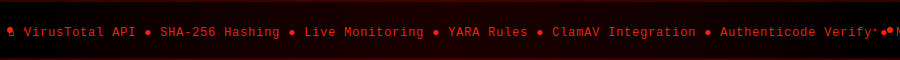

<p align="center">
  
</p>

<p align="center">
  
</p>

<p align="center">
  
  
  
  
  
</p>

---

<p align="center">
  <b>GhostProcess</b> is a <b>dark-themed GUI process scanner</b> that hunts malicious executables hiding in your system's memory.<br/>
  It computes SHA-256 hashes of every running process, queries live threat intelligence APIs, applies YARA rules,<br/>
  and gives you a clear red/green verdict — all from a slick Tkinter dashboard.
</p>

<br/>

## `> WHAT IS IT?`

```
[*] Scanning PID 4812 — svchost.exe ........... CLEAN
[!] Scanning PID 9271 — x64injector.exe ....... MALICIOUS  [ 48/72 detections ]
[?] Scanning PID 1394 — unknown_stub.exe ...... UNKNOWN
```

GhostProcess enumerates every running process on your machine, hashes its binary, and cross-references it against multiple threat intelligence sources in parallel. Results are displayed live in a tabbed dashboard with KPI cards, detailed process tables, and a process tree view. Suspects can be terminated, quarantined, and exported to PDF, JSON, or CSV in one click.

<br/>

<p align="center">
  
</p>

## `> FEATURES`

<table>
<tr>
<td width="50%" valign="top">

### 🔴 Threat Intelligence
- **VirusTotal API** — real-time reputation lookup per SHA-256
- **MalwareBazaar** — query Abuse.ch's malware hash database
- **ThreatFox** — IOC lookups via Abuse.ch ThreatFox API
- **Local Hash Database** — flat file or SQLite IOC store
- **Threat Feed CSV** — load custom threat indicator lists
- **Offline Mode** — run completely air-gapped with local data

### 🔴 Static Analysis
- **SHA-256 Hashing** — computed for every process binary
- **YARA Rules** — apply rule files or directories per scan
- **ClamAV Integration** — invoke `clamscan` per executable
- **Authenticode Verification** — Windows WinVerifyTrust check
- **Publisher Extraction** — reads version resource CompanyName

</td>
<td width="50%" valign="top">

### 🔴 Live Operations
- **Live Process Monitor** — polls for new processes every 2s
- **Baseline Drift Detection** — flags hashes absent from baseline
- **Multi-threaded Scanning** — parallel hash + API calls via ThreadPoolExecutor
- **Hash & VT Cache** — avoids redundant disk reads and API calls
- **Kill Process** — terminate suspect PIDs with one click
- **Rescan Selected** — re-evaluate a single process on demand

### 🔴 Reporting & Export
- **PDF Reports** — branded, formatted via ReportLab
- **JSON Export** — full structured result dump
- **CSV Export** — spreadsheet-ready process records
- **Copy SHA-256** — clipboard copy for pivot investigation
- **Open File Location** — jump to process binary on disk

</td>
</tr>
</table>

<p align="center">
  
</p>

## `> UI & THEMES`

GhostProcess ships with a polished multi-theme Tkinter UI inspired by professional SOC dashboards.

| Theme | Palette |
|---|---|
| **SOC Nightfall** | Deep navy · Sky blue accent · Rose red alerts |
| **Midnight Terminal** | Pure black · Teal matrix · Coral red alerts |
| **Red Cell** | Blood red dark · Crimson accent |
| **Arctic Blue** | Slate dark · Electric blue accent |
| **Dracula** | Purple-grey · Pink accent |
| **Solarized Dark** | Warm dark · Orange/yellow accent |
| **One Dark** | VSCode-style dark · Purple accent |

Custom accent colors (Red, Cyan, Green, Purple, Orange, and more) can be applied on top of any theme. Settings persist to `~/.suspicious_process_scanner/ui_config.json`.

<p align="center">
  
</p>

## `> INSTALLATION`

### Prerequisites

| Requirement | Version |
|---|---|
| Python | 3.10 or higher |
| pip | Latest |
| VirusTotal API Key | Free tier works |

### Quick Setup

```bash
# 1. Clone the repository
git clone https://github.com/YOUR_USERNAME/GhostProcess.git
cd GhostProcess

# 2. Install dependencies
pip install psutil requests reportlab

# Optional: YARA support
pip install yara-python

# 3. Launch
python GhostProcess.py
```

### Dependencies

```
psutil       — Process enumeration and system info
requests     — VirusTotal / MalwareBazaar / ThreatFox HTTP calls
reportlab    — PDF report generation (optional but recommended)
tkinter      — Bundled with standard Python (GUI framework)
yara-python  — YARA rule scanning (optional)
```

> **Windows users:** `ctypes` and `wintrust.dll` are used automatically for Authenticode signature verification — no extra setup needed.

<p align="center">
  
</p>

## `> CONFIGURATION`

### API Keys (Settings Tab)

Open the **Settings** tab inside the app and enter your keys:

```
VirusTotal API Key  →  [ your key here ]
MalwareBazaar Key   →  [ your key here ] (optional)
ThreatFox Key       →  [ your key here ] (optional)
```

Keys are saved locally to `~/.suspicious_process_scanner/ui_config.json` and never transmitted except to their respective APIs.

### Offline / Air-Gap Mode

Enable **Offline Mode** in Settings to disable all outbound API calls. Local sources still apply:

```
Threat Feed   →  CSV file with known-bad hashes or names
Hash Database →  Flat file or SQLite DB with IOC hashes
YARA Rules    →  .yar / .yara file or directory
ClamAV        →  Path to clamscan executable
SQLite IOC DB →  .db / .sqlite file with malicious hashes
```

<p align="center">
  
</p>

## `> USAGE`

```
┌─────────────────────────────────────────────┐
│  GhostProcess — Process Reputation Analyzer  │
├─────────────────────────────────────────────┤
│  [ SCAN ]   [ LIVE ●]   [ EXPORT ▼ ]        │
├─────────────────────────────────────────────┤
│  ┌──────────┐ ┌──────────┐ ┌──────────────┐ │
│  │ SCANNED  │ │MALICIOUS │ │   UNKNOWN    │ │
│  │   247    │ │    3     │ │     12       │ │
│  └──────────┘ └──────────┘ └──────────────┘ │
│                                              │
│  Tabs: Summary | Results | Process Tree      │
└─────────────────────────────────────────────┘
```

1. **Launch** `python GhostProcess.py`
2. **Set your API key** in the Settings tab
3. Click **Scan** — all running processes are enumerated and hashed
4. Review **KPI cards** for a quick risk overview
5. Switch to **Results** tab for the full table — sort by Verdict to surface threats
6. Right-click any row to **Kill**, **Rescan**, **Copy Hash**, or **Open File Location**
7. Enable **Live Monitor** to catch new processes as they spawn
8. Hit **Export → PDF** to generate a timestamped incident report

<p align="center">
  
</p>

## `> HOW IT WORKS`

```
Running Processes (psutil)
        │
        ▼
SHA-256 Hash  ←── Cache Hit? ──→  Return Cached
        │
        ▼
  ┌─────────────────────────────────────────┐
  │      Parallel Threat Intel Lookup       │
  │  VirusTotal │ MalwareBazaar │ ThreatFox │
  │  Local CSV  │  SQLite DB    │ ClamAV    │
  │  YARA Rules │  Baseline     │ WinTrust  │
  └─────────────────────────────────────────┘
        │
        ▼
  Verdict: CLEAN / MALICIOUS / UNKNOWN
        │
        ▼
  Risk Score → KPI Cards → Results Table → PDF Report
```

**Baseline Drift Detection** compares the current scan's hashes against a known-good baseline saved from a previous clean run. Any hash not in the baseline is flagged as potentially new or drifted — useful for detecting fileless malware or process substitution.

<p align="center">
  
</p>

## `> PROJECT STRUCTURE`

```
GhostProcess/
├── GhostProcess.py        ← Main application (single-file)
├── assets/
│   └── ghostprocess_logo.png   ← Branding logo for PDF reports
├── README.md
└── requirements.txt
```

<p align="center">
  
</p>

## `> REQUIREMENTS.TXT`

```
psutil>=5.9.0
requests>=2.28.0
reportlab>=4.0.0
yara-python>=4.3.0
```

<p align="center">
  
</p>

## `> DISCLAIMER`

> **GhostProcess is a defensive security tool intended for use on systems you own or have explicit authorization to analyze.**
> Unauthorized scanning of systems is illegal. The author assumes no liability for misuse.
> VirusTotal, MalwareBazaar, and ThreatFox are third-party services — their terms of service apply.

<p align="center">
  
</p>

## `> ROADMAP`

- [ ] Network connection inspection per-process (already partially implemented via `ipaddress` module)
- [ ] VirusTotal file submission for unknown hashes
- [ ] Scheduled / recurring scans
- [ ] Tray icon for persistent background monitoring
- [ ] Electron/web UI port
- [ ] Plugin system for custom intel sources

<p align="center">
  
</p>

## `> CREDITS`

<p align="center">
  Made with 🔴 by <b>Byte-Sized Wisdom</b><br/>
  <i>"Know your processes. Know your system."</i>
</p>

<p align="center">
  
</p>
